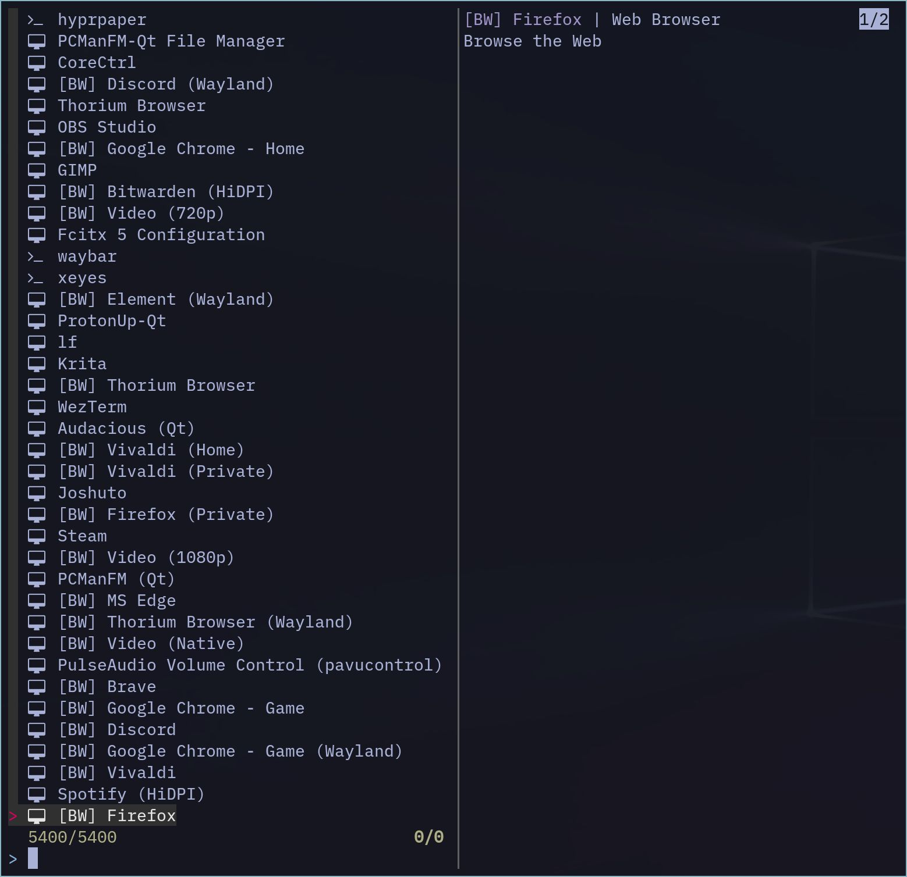
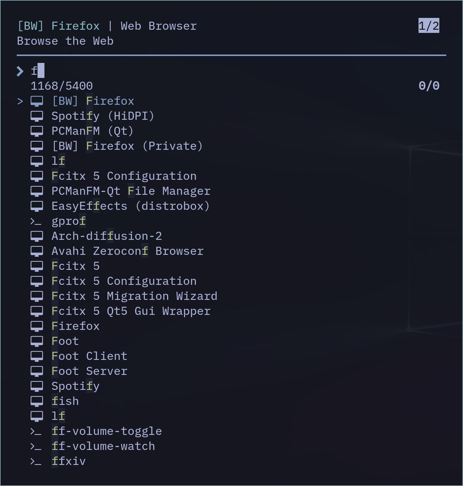

sklauncher
==========

[](https://crates.io/crates/sklauncher)


Rust-written terminal based application launcher for Linux, inspired by [sway-launcher-desktop](https://github.com/Biont/sway-launcher-desktop), based on [skim](https://github.com/lotabout/skim) fuzzy finder.


Features
--------

- List and execute `.desktop` files
- List and execute binary files
- Fuzzy search with built-in [skim](https://github.com/lotabout/skim) fuzzy finder
- History-based ordering
- Direct raw-command execution support
- Support [skim](https://github.com/lotabout/skim)'s options and customizable (currently not all options are available)
- Optional prefix command to wrap execution (e.g., `--command-prefix 'app2unit --'`)

Installation
------------

### Stable Version

```
cargo install sklauncher
```

### Develop Version

```
git clone https://github.com/miyakogi/sklauncher.git
cd sklauncher
cargo install --locked --path .
```

Example Usage
------------

On [Sway WM](https://swaywm.org) + [foot terminal](https://codeberg.org/dnkl/foot)

### Simple (Default)

```conf
# ~/.config/sway/config

bindsym $mod+d exec foot --app-id sklauncher sklauncher
for_window [app_id="^sklauncher$"] floating enable, sticky enable
```



### Customized

```conf
# ~/.config/sway/config

bindsym $mod+d exec foot --app-id sklauncher sklauncher --match-generic-name --tiebreak "index" --no-sort --accent-color "cyan" --color "16,bg+:-1,fg+:4,prompt:4,pointer:4" --reverse --margin "1,2" --prompt " " --preview-window "up:3"
for_window [app_id="^sklauncher$"] floating enable, sticky enable
```



### Prefix command example

Wrap the selected command with another launcher or shim. For example, to insert `app2unit --` before the chosen command:

```
sklauncher --command-prefix 'app2unit --'
```

See `sklauncher --help` for more information about available options.

Keybinding
----------

See: [Skim's document](https://github.com/lotabout/skim#key-bindings)

Search Syntax
-------------

See: [Skim's document](https://github.com/lotabout/skim#search-syntax)
